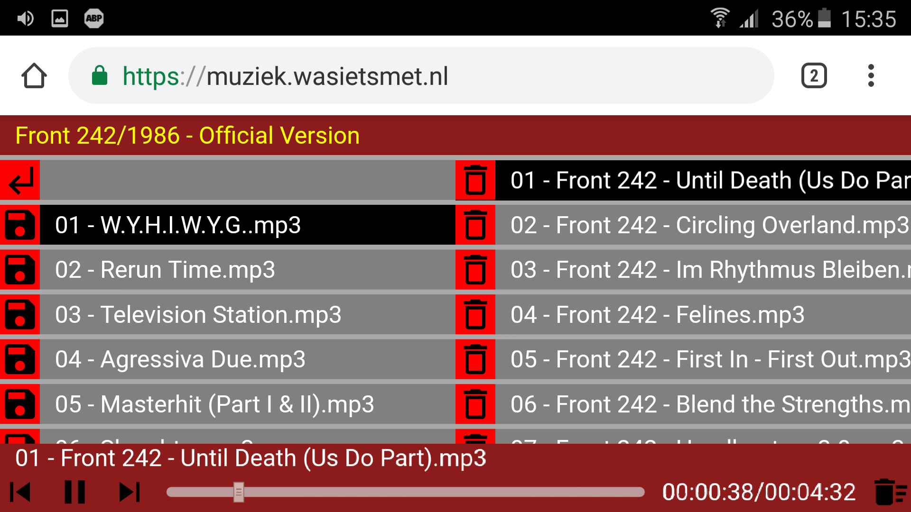
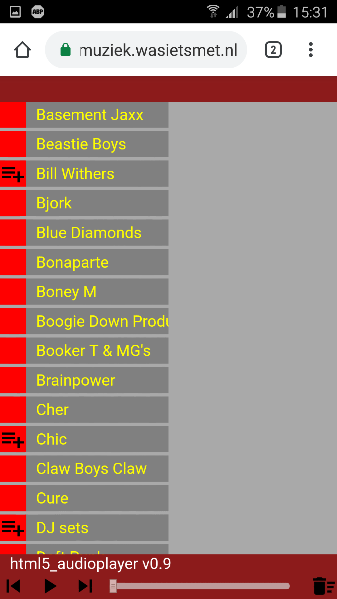
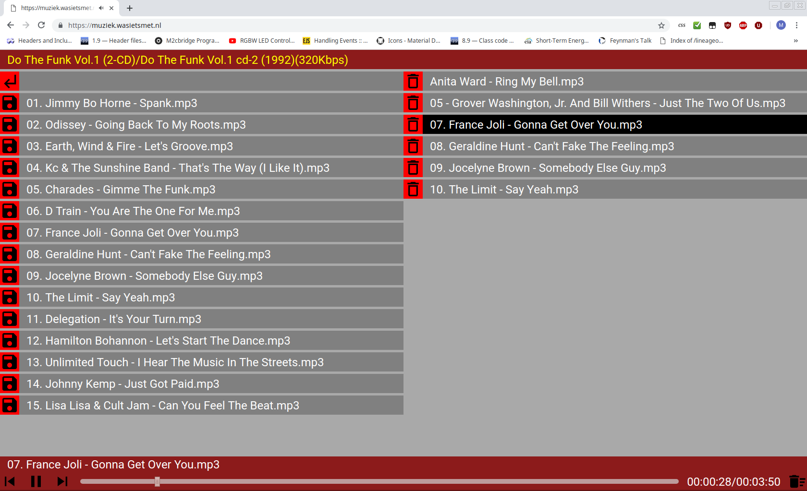
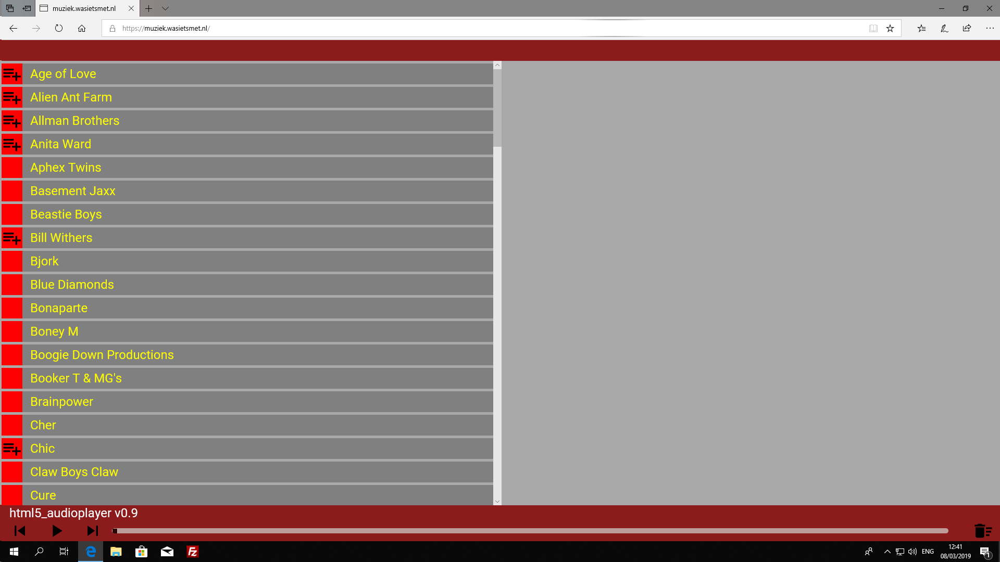
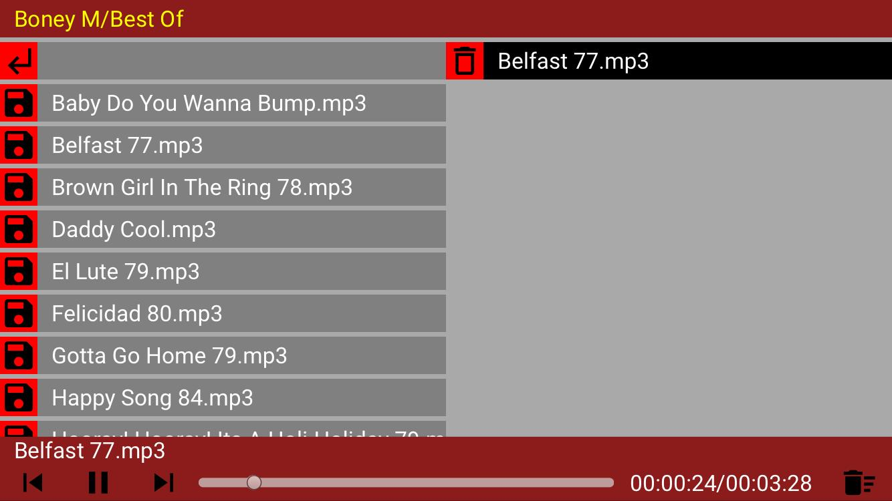
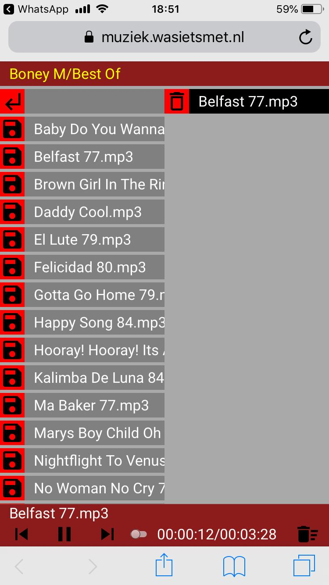

# html5_audioplayer

[](https://app.codacy.com/manual/CelliesProjects/html5_audioplayer?utm_source=github.com&utm_medium=referral&utm_content=CelliesProjects/html5_audioplayer&utm_campaign=Badge_Grade_Dashboard)

html5_audioplayer provides an easy way to stream the music from your lamp server.
<br>It is intended as a replacement for the Apache plugin `mod_musicindex` which was a pain to install and is not maintained anymore.
<br><br>html5_audioplayer is a simple one-file drop-in musicplayer.
<br>Just symlink `htdocs` to the root of your music collection and copy `index.php` to that folder and it works.

html5_audioplayer on a Samsung Galaxy S5 NEO Android phone.


### You will need:
- A working Apache webserver with PHP enabled.<br>
Actual versions should not matter that much but the player is developed against Apache 2.4 and PHP 7.
- A folder with MP3s, OGGs and/or WAV files.
- (Optionally) `exiftool` to show the bitrate. Default setting is to not show the bitrate.

To show the bitrate of the currently playing song `$showBitrate` in `index.php` has to be set to `true` and `exiftool` has to be installed.
<br>To install `exiftool` enter the following in a terminal:
<br>
````
sudo apt-get install exiftool
````

### Easy setup:
With Apache 2.4, easiest setup is to symlink `htdocs` to the folder where you keep your music files.
<br>Copy `index.php` to this folder and you should be good to go.

The player will provide a simple interface with a browser area on the left and a playlist on the right.

Navigate to and click on a file in the left pane to add it to the playlist.
<br>If there are already songs in the playlist the clicked song will be added to the end of the playlist.
<br>If the player is paused the clicked song starts playing immediately.


### Used libraries:
- The used icons are from [material.io](https://material.io/tools/icons/?style=baseline) and are [available under Apache2.0 license](https://www.apache.org/licenses/LICENSE-2.0.html).
- Uses [Google Roboto font](https://fonts.google.com/specimen/Roboto) which is [available under Apache2.0 license](https://www.apache.org/licenses/LICENSE-2.0.html).
- Uses [jQuery 3.3.1](https://code.jquery.com/jquery-3.3.1.js) which is [available under MIT license](https://jquery.org/license/).

### Screenshots:
#### Android Samsung S5 NEO Chrome landscape


#### Android Samsung S5 NEO Chrome portrait


#### PC Linux Mint Chrome


#### PC Windows 10 Edge


#### Iphone Safari landscape


#### Iphone Safari portrait

