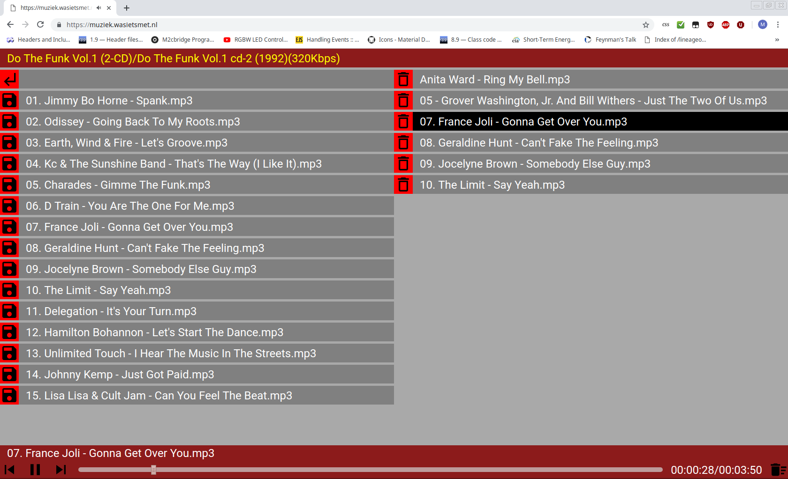

# html5_audioplayer
A simple single file html5 audio player.

### You will need:
- A working webserver with PHP enabled. 
 ( Apache2.4, PHP > 5 )
- A folder with MP3s, OGGs and/or WAV files.

Just drop `index.php` in a folder containing MP3s, OGG or WAV files.
 
 It will provide a simple player with a browser area on the left and a playlist on the right.
 Navigate to and click on a song in the left pane to add it to the playlist.
 If there are already songs in the playlist the clicked song will be added to the end of the playlist.
 If no song is playing the clicked song start playing immediately.

### Easy setup:
With Apache 2.4, easiest setup is to symlink `htdocs` to the folder where you keep your music files.
 Copy `index.php` to this folder and you should be good to go.

### Disclaimer:
- The used icons are from [material.io](https://material.io/tools/icons/?style=baseline).
- Uses [Google Roboto font](https://fonts.google.com/specimen/Roboto)
- Uses [jQuery 3.3.1](https://code.jquery.com/jquery-3.3.1.js).

### Some screenshots:

